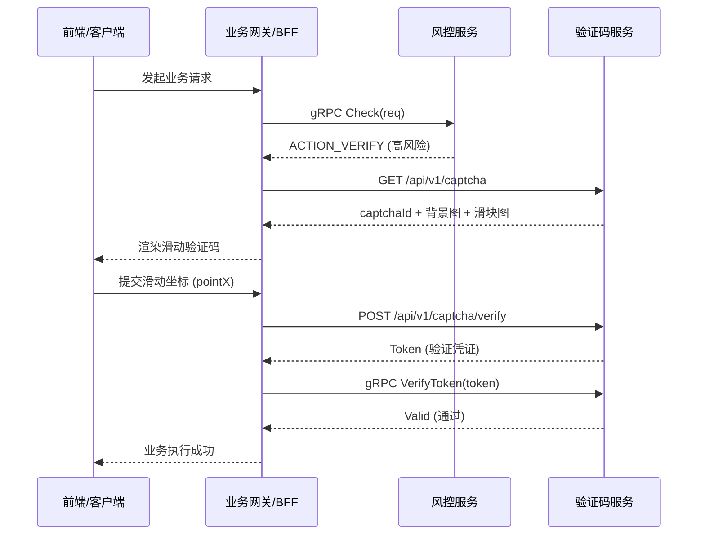

# Risk Engine (风控引擎)

本项目是一个高性能的分布式风控系统，基于 Go 语言开发。当前在同一仓库内维护两个高度解耦的微服务：**风险引擎 (Risk Engine)** 与 **验证码服务 (Captcha Service)**。

## 🚀 核心功能

### 1. 风险引擎 (Risk Engine)
- **黑名单管理**：支持基于 IP 和 UserID 的动态黑名单拦截。
- **频控检测 (Rate Limiting)**：
  - **多维度限流**：支持 IP 级别和用户级别的精准限流（固定窗口/滑动窗口逻辑）。
  - **原子操作**：基于 Redis Lua 脚本实现高性能原子计数，确保并发安全。
- **防暴力破解**：识别高频失败登录等异常行为并自动触发验证码挑战。

### 2. 验证码服务 (Captcha Service)
- **滑动验证码**：采用交互友好的滑动拼图模式（基于 `go-captcha`）。
- **像素级校验**：后端自动生成随机缺口，支持自定义位置容差（Tolerance）。
- **Token 机制**：验证通过后签发基于 HMAC-SHA256 的 Stateless Token。
- **双协议支持**：
  - **HTTP (BFF/前端)**：用于验证码获取及滑动结果校验。
  - **gRPC (内部服务)**：用于 Token 的合法性及有效性核验。

## 🔌 服务交互架构

### 最小交互原则
- 风控引擎负责判断风险并决定是否需要验证。
- 验证码服务负责执行具体的验证逻辑及 Token 签发。
- 业务系统通过 gRPC 接口校验 Token，实现业务闭环。

### 交互时序图



## 🛠️ 技术栈

- **语言**：Go (v1.25.1+)
- **通信**：gRPC, Gin (HTTP)
- **存储**：Redis (用于存储验证码答案及频控计数)
- **配置**：Viper
- **日志**：Uber-go Zap (结构化 JSON 日志)

## 📁 项目结构

```text
risk-engine/
├── cmd/
│   ├── risk-server/        # 风险引擎服务入口
│   └── captcha-server/     # 验证码服务入口
├── configs/                # 配置文件模板
├── internal/
│   ├── config/             # 配置解析 (risk_config.go, captcha_config.go)
│   ├── risk/               # 风险引擎业务逻辑
│   ├── captcha/            # 验证码业务逻辑
│   └── transport/
│       └── http/           # HTTP 路由与 Handler
├── web-test/               # 测试工具 (前端演示页面 & gRPC 客户端脚本)
├── build.bat               # Windows 一键构建脚本 (输出 Linux 二进制)
├── go.mod                  # 依赖管理
└── README.md
```

## 🚥 快速开始

### 1. Protobuf 依赖管理 (API First)

本项目遵循 **API First** 原则，不直接维护任何 `.proto` 文件。所有的接口定义及生成的 Go 代码均统一维护在独立仓库：
👉 **[risk-proto](https://github.com/Pupervemon/risk-proto)**

- **引用方式**：本项目通过 `go.mod` 直接引用 `github.com/Pupervemon/risk-proto`。
- **本地开发**：为了方便联调，`go.mod` 中默认使用了 `replace` 指令指向本地的 `../risk-proto` 目录。
- **环境要求**：在本地开发环境下，请确保 `risk-proto` 仓库已克隆至与本项目平行的目录中：
  ```text
  workspace/
  ├── risk-engine/  (当前仓库)
  └── risk-proto/   (接口仓库)
  ```

### 2. 配置环境

1. 准备配置文件：
   ```bash
   cp configs/risk.template.yaml configs/risk.yaml
   ```
2. 配置验证码服务（涉及 Redis 及签名 Secret）：
   ```bash
   cp configs/captcha.template.yaml configs/captcha.yaml
   ```

### 2. 运行服务

**启动风险引擎：**
```bash
go run cmd/risk-server/main.go
```
*默认端口：gRPC :9090*

**启动验证码服务：**
```bash
go run cmd/captcha-server/main.go
```
*默认端口：HTTP :8080, gRPC :9091*

### 3. 构建部署

运行 `build.bat` 将在 `dist/` 目录下生成适用于 Linux 环境的二进制文件：
- `dist/risk-server`
- `dist/captcha-server`

## 🧪 验证与调试

本项目提供了便捷的本地验证工具：
1. **滑动验证演示**：直接在浏览器打开 `web-test/index.html`，可进行完整的滑动验证流程。
2. **gRPC 接口测试**：
   ```bash
   go run web-test/test_grpc_client.go "YOUR_TOKEN_HERE"
   ```

---
Developed by [Pupervemon](https://github.com/Pupervemon)
