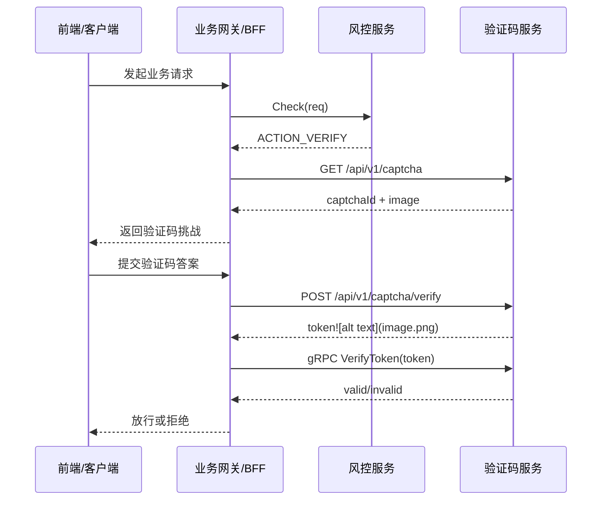

# Risk Engine (风控引擎)

本项目是一个高性能的分布式风控系统，基于 Go 语言开发。当前在同一仓库内维护两个解耦服务：风险引擎与验证码服务，便于后续独立拆分部署。

## 🚀 核心功能

### 1. 风险引擎 (Risk Engine)
- **黑名单管理**：支持基于 IP 和 UserID 的动态黑名单拦截。
- **频控检测 (Rate Limiting)**：
  - **多维度限流**：支持 IP 级别和用户级别的精准限流。
  - **原子操作**：基于 Redis Lua 脚本实现高性能原子计数。
- **防暴力破解**：自动识别异常登录行为并触发风险处置。
- **事件上报**：支持业务端异步上报操作结果，动态更新风险画像。

### 2. 验证码服务 (Captcha Service)
- **验证码生成**：基于 `base64Captcha` 生成图形验证码，支持宽高、噪点、干扰线等配置。
- **安全验证**：基于 Redis 的一次性验证码校验机制。
- **Token 鉴权**：验证成功后签发基于 HMAC-SHA256 的安全 Token。
- **双协议支持**：提供 RESTful HTTP 接口供前端使用，提供 gRPC 接口供内部服务校验。

## 🔌 服务边界契约（解耦）

- **风险引擎职责**：只做风险判断与规则执行（黑名单、频控、防爆破）。
- **验证码服务职责**：只做验证码生成/校验与 token 生命周期管理。
- **交集方式**：仅通过业务流程与协议字段交互，不共享业务代码与内部状态。

### 最小交互原则
- 风控引擎在高风险场景返回 `ACTION_VERIFY`。
- 业务网关/BFF 根据 `ACTION_VERIFY` 调用验证码服务（HTTP）。
- 验证通过后由验证码服务签发 token；内部服务通过验证码服务 gRPC `VerifyToken` 校验。
- 风控服务不依赖验证码实现细节，不读写验证码答案。

### 交互时序图



## 🛠️ 技术栈

- **语言**：Go (v1.25.1)
- **通信**：gRPC, Gin (HTTP)
- **存储**：Redis
- **配置**：Viper
- **日志**：Uber-go Zap

## 📁 项目结构

```text
risk-engine/
├── cmd/
│   ├── server/             # 风控核心服务入口
│   └── captcha-server/     # 验证码服务入口
├── configs/                # 配置文件模板 (yaml)
├── internal/
│   ├── config/             # 配置解析与管理
│   ├── risk/
│   │   └── service/        # 风控业务逻辑
│   ├── captcha/
│   │   └── service/        # 验证码业务逻辑
│   └── transport/
│       └── http/           # HTTP 传输层实现
├── go.mod                  # 依赖管理
└── README.md
```

> Protobuf 定义与生成代码统一维护在上级仓库 `risk-proto`。

## 🚥 快速开始

### 1. 前置条件

- **Go**: 1.25.1+
- **Redis**: 6.0+
- **Protocol Buffers**: 需配合 `risk-proto` 生成的代码使用

### 2. 配置环境

1. 复制配置模板：
   ```bash
   cp configs/risk.template.yaml configs/risk.yaml
   ```
2. (可选) 配置验证码服务：
   ```bash
   cp configs/captcha.template.yaml configs/captcha.yaml
   ```

### 3. 运行服务

**启动风控核心服务：**
```bash
go run cmd/server/main.go
```
*默认端口：gRPC :9090*

**启动验证码服务：**
```bash
go run cmd/captcha-server/main.go
```
*默认端口：HTTP :8080, gRPC :9091*

## 📖 接口说明

### 验证码服务 (HTTP)
| 接口 | 方法 | 说明 |
| :--- | :--- | :--- |
| `/api/v1/captcha` | GET | 获取验证码 ID 及 Base64 图片 |
| `/api/v1/captcha/verify` | POST | 校验验证码，成功则返回 Token |

### 验证码校验 (gRPC)
- **服务名**: `CaptchaTokenService`
- **方法**: `VerifyToken`
- **用途**: 内部服务通过此接口校验用户提交的 Token 是否由验证码系统签发且有效。

### 风控核心 (gRPC)
- `Check`: 综合风险检测。
- `ReportEvent`: 业务结果上报。
- `AddBlacklist`: 手动维护黑名单。

---
Developed by [Pupervemon](https://github.com/Pupervemon)
