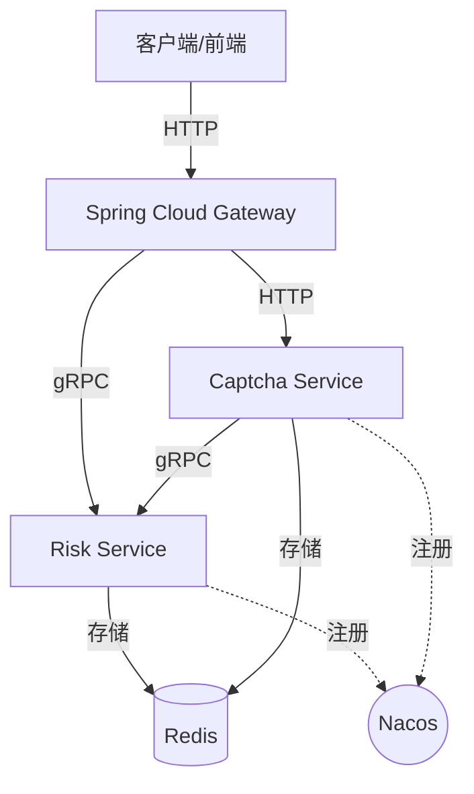

# Risk Engine (分布式风控引擎)

[](https://golang.org)
[](LICENSE)
[](https://grpc.io)

本项目是一个高性能、插件化的分布式风控系统，旨在为互联网应用提供人机识别、频控拦截、暴力破解防护等核心安全能力。

## 🚀 核心架构

系统采用微服务架构，基于 **API First** 原则开发，实现业务逻辑与传输协议的高度解耦。

- **Captcha Service (验证码服务)**: 负责人机识别，支持滑动拼图验证，签发无状态安全 Token。
- **Risk Service (风控引擎)**: 负责多维度风险决策（IP/UserID）、黑名单管理及行为频控。

### 系统拓扑


---

## ✨ 核心特性

- **🛡️ 智能风控判定**: 支持 IP/UserID 双维度拦截，内置滑动验证码挑战触发机制。
- **🔐 滑动拼图验证**: 基于 `go-captcha` 实现，支持 HMAC-SHA256 安全签名。
- **🌐 双协议支持**: HTTP 用于前端交互，gRPC 用于内部服务间高性能通信。
- **⚙️ 多环境配置**: 支持 `dev` / `prod` 环境一键切换，集成 `godotenv` 管理敏感信息。
- **📡 自动注册发现**: 深度集成 Nacos v2，支持多端口（HTTP/gRPC）元数据自动上报。
- **🏥 全方位监控**: 提供符合 Kubernetes 标准的就绪（Ready）与存活（Live）健康检查接口。

---

## 📂 项目结构

```text
.
├── cmd/
│   ├── captcha-server/     # 验证码服务程序入口
│   └── risk-server/        # 风控服务程序入口
├── configs/                # 配置文件（模板及各环境配置）
├── docs/                   # 详细技术指南（配置、Java客户端等）
├── internal/
│   ├── captcha/            # 验证码业务逻辑
│   ├── risk/               # 风控决策逻辑
│   └── shared/             # 共享模块（配置管理、注册中心、健康检查）
├── web-test/               # 验证工具（前端 Demo 与 gRPC 测试脚本）
├── .env.example            # 环境变量模板
├── build.bat               # Windows 一键跨平台构建脚本
├── start.ps1               # Windows PowerShell 启动脚本
└── start.sh                # Linux/Mac 启动脚本
```

---

## 🛠️ 快速开始

### 1. 准备工作
- **Go**: 1.25.1+
- **Redis**: 6.0+
- **Nacos**: 2.0+ (可选)
- **接口协议**: 本项目依赖 [risk-proto](https://github.com/Pupervemon/risk-proto) 仓库，请确保其与本项目处于平行目录。

### 2. 配置初始化
```bash
# 创建环境变量配置文件
cp .env.example .env

# (可选) 自定义各环境 YAML 配置
# 配置文件位于 configs/captcha.dev.yaml 等
```

### 3. 一键启动 (推荐)
本项目提供了快捷启动脚本，支持自动设置 `APP_ENV`。

**Windows (PowerShell):**
```powershell
# 启动验证码服务 (开发环境)
.\start.ps1 dev captcha

# 启动风控服务 (开发环境)
.\start.ps1 dev risk
```

**Linux/Mac:**
```bash
chmod +x start.sh
./start.sh dev captcha
./start.sh dev risk
```

### 4. 运行验证
- **前端演示**: 直接打开 `web-test/index.html` 体验滑动验证码。
- **健康检查**: 访问 `http://localhost:8091/health` (Captcha) 或 `http://localhost:9080/health` (Risk)。

---

## 📖 开发者手册

### 多环境切换
通过 `APP_ENV` 环境变量控制加载的配置文件：
- `dev`: 加载 `*.dev.yaml`，适用于本地开发，通常禁用 Nacos。
- `prod`: 加载 `*.prod.yaml`，适用于生产环境，强制要求安全配置（如 Redis 密码）。

### 接口契约 (API First)
修改接口定义请前往 `risk-proto` 仓库，本项目通过 `go.mod` 引用。本地开发可启用 `replace` 指令进行联调。

### 编译构建
执行 `build.bat` 将生成适用于 Linux (amd64) 的二进制文件至 `dist/` 目录。

---

## 📝 许可证
本项目采用 [MIT License](LICENSE) 协议。

## 👥 贡献
期待您的 PR 或 Issue！
- **作者**: [Pupervemon](https://github.com/Pupervemon)
- **仓库**: [risk-engine](https://github.com/Pupervemon/risk-engine)
